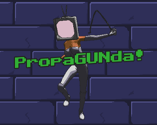

# PropaGUNda 

The game is built for [Go Godot 4 Game Jam](https://itch.io/jam/go-godot-jam-4)
You can try it out [HERE](https://glukozavr.itch.io/propagunda)

The game is HTML5-ready and have some UI issues, but it works!

## Theme is LESS IS MORE

For this game we defined it as Less HEALTH is More POWER!

This is a shooter game, that have 2 weapon types - katana and a gun.

Main mechanics are perks, that you randomly get in between round.

1. Motivation! Less Health is More Speed
2. Revenge! Less Health is More Damage
3. Blood Magazine! Less Health is More Bullets
4. Mazohism! Less Health is More Everything!

And also you can heal sometimes. 

Created by [Viktor aka Glukozavr](https://twitter.com/Glukozavr) and [Max Kravchenko](https://twitter.com/i_am_max_k)

Game is started with an [FPS template for Godot](https://github.com/Whimfoome/godot-FirstPersonStarter)
